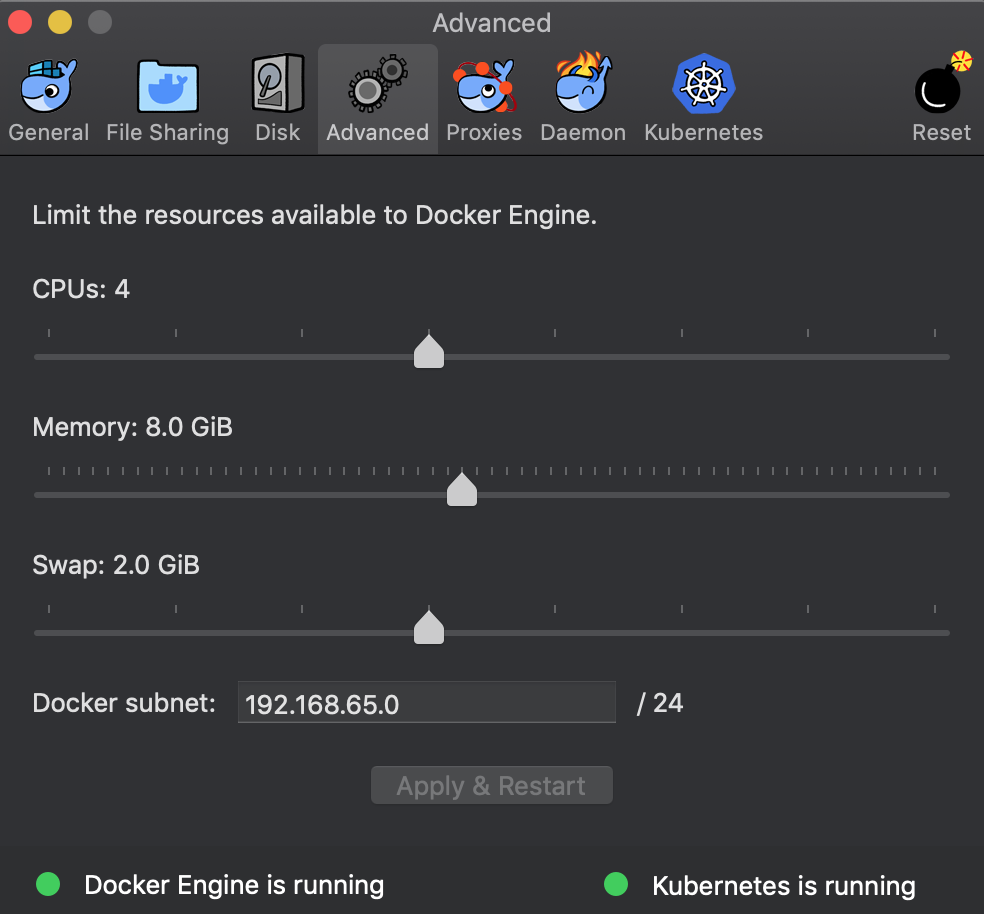

# Bookinfo Application 

## Before begin

### 개요
- 4가지 microservice의 조합인 Bookinfo Application을 만들어보자.
 - productpage : details와 reviews라는 microservices를 호출하는 페이지
 - details : 책 정보를 제공하는 microservice
 - reviews : 책의 리뷰를 제공하는 microservice, 또한 ratins라는 microservice를 호출한다.
 - ratings : 책의 랭킹 정보를 제공하는 microservice
- reviews에는 3가지 버전을 제공한다.
 - v1 : ratings 서비스를 호출하지 않는다.
 - v2 : ratings 서비스를 호출하고, 1~5개의 black star를 보여준다.
 - v3 : ratings 서비스를 호출하고, 1~5개의 red star를 보여준다.
 
- istio를 사용하지 않는 Bookinfo Application은 아래와 같다.

 
### Preparation
- [Install istio](https://github.com/grepsean/study-istio/blob/master/setup.md)
 
## Deploying the application
- 본 예제를 istio에서 실행하기 위해서 application의 변경은 필요없다. 단지 istio가 설치된 환경에서 서비스를 설정하고 실행시키면 된다.
- istio를 사용하는 경우 Bookinfo Application은 아래와 같다.


### 각 Microservice(Application)을 살펴보자

#### produtpage
- 사용 언어 및 주요 프레임워크 : `Python`, `Flask`
- 내부 동작 : 
  - /productpage : `productId`를 전달받아서 `product`를 찾고, `details`와 `ratings`라는 microservices를 REST 호출하여 `json`결과를 취해서 최종적으로 html 페이지를 렌더링한다.

#### reviews
- 사용 언어 및 주요 프레임워크 : `Java`, `JAX-RS`
- 내부 동작 :
  - /reviews : 
    - `productId`를 전달받아 `ratings`라는 microservice를 호출한다.
      - https://github.com/istio/istio/blob/master/samples/bookinfo/src/reviews/reviews-application/src/main/java/application/rest/LibertyRestEndpoint.java#L93
    - 호출 결과(`ratings`)를 가지고, reviewer1, reviewer2를 합친 reviews 결과를 json으로 반환한다.
      - https://github.com/istio/istio/blob/master/samples/bookinfo/src/reviews/reviews-application/src/main/java/application/rest/LibertyRestEndpoint.java#L47
    - 이 microservice에서는 STAR_COLOR, ENABLE_RATINGS 같은 환경변수를 주입받아서 사용한다.
      - https://github.com/istio/istio/blob/master/samples/bookinfo/src/reviews/reviews-application/src/main/java/application/rest/LibertyRestEndpoint.java#L42
      - https://github.com/istio/istio/blob/master/samples/bookinfo/src/build-services.sh#L50
      - https://github.com/istio/istio/blob/master/samples/bookinfo/src/reviews/reviews-wlpcfg/Dockerfile#L28

#### details
- 사용 언어 및 주요 프레임워크 : `Ruby`, `Webrick`
- 내부 동작 : 
  - /details : `id`를 전달받아서, 상세 정보를 json으로 반환한다.
    - https://github.com/istio/istio/blob/master/samples/bookinfo/src/details/details.rb#L67
  - tracing() : Zipkin과 같은 tracing tool에서의 사용하는 headers(`x-b3-***`)를 검사하여, 새로운 `span`을 생성한다. 
    - https://github.com/istio/istio/blob/master/samples/bookinfo/src/productpage/productpage.py#L130

#### ratings
- 사용 언어 및 주요 프레임워크 : ``Node.js`, `httpdispatcher`
- 내부 동작 :
  - /ratings : `reviewer`들의 `ratings` 점수를 json으로 반환한다.
    - 버전에 따라 다른 동작을 한다.
      - `v1`에서는 그냥 hard coded data 
        - https://github.com/istio/istio/blob/master/samples/bookinfo/src/ratings/ratings.js#L142
      - `v2`에서는 DB를 사용하며, DB_TYPE이라는 환경변수를 통해서 Mysql 혹은 Mongo DB를 사용해서 ratings를 가져온다. 
        - https://github.com/istio/istio/blob/master/samples/bookinfo/src/ratings/ratings.js#L73
      - _개인적인 의견 : 버전에 따른 로직을 내부에서 분기하기보다는 버전마다 다른 image(with tag)로 만드는것이 MSA의 장점을 취하는 방법이라고 생각한다._

### Kubernetes 환경에서의 실행
  `Minikube환경에서는 적어도 4GB램을 보장되어야한다. GKE환경에서는 적어도 4개의 GKE nodes가 필요하다.`
  `본 예제의 환경인 DockerCE에서는 Advanced 메뉴를 통해서 8GB정도를 할당하는 것을 추천한다.`


  
1. automatic sidecar injection을 사용하기 위해서 application을 실행시킬 namespace(본 예제에서는 default를 사용함)에 labeling하자.
  ```console
  $ kubectl label namespace default istio-injection=enabled
  ```
2. bookinfo application을 배포하자. 여기서는 istio가 설치된 디렉토리 아래 sample 디렉토리에 있는 yaml파일들을 사용한다.
  ```console
  $ pwd 
  some-path/istio-1.1.2
  $ kubectl apply -f samples/bookinfo/platform/kube/bookinfo.yaml
  ```
  - 만약 automatic sidecar injection이 disable된 상태에서 [manual sidecar injection](https://istio.io/docs/setup/kubernetes/additional-setup/sidecar-injection/#manual-sidecar-injection)을 사용하고 싶다면, `istioctl kube-inject` 커맨드를 사용해서 bookinfo.yaml을 기준으로 살짝 변경한 결과를 가지고 실행시킨다.
  ```console
  $ kubectl apply -f <(istioctl kube-inject -f samples/bookinfo/platform/kube/bookinfo.yaml)
  ```
3. 배포된 서비스를 확인해보자.
  ```console
  $ kubectl get services
  NAME                       CLUSTER-IP   EXTERNAL-IP   PORT(S)              AGE
  details                    10.0.0.31    <none>        9080/TCP             6m
  kubernetes                 10.0.0.1     <none>        443/TCP              7d
  productpage                10.0.0.120   <none>        9080/TCP             6m
  ratings                    10.0.0.15    <none>        9080/TCP             6m
  reviews                    10.0.0.170   <none>        9080/TCP             6m
  
  $ kubectl get pods
  NAME                                        READY     STATUS    RESTARTS   AGE
  details-v1-1520924117-48z17                 2/2       Running   0          6m
  productpage-v1-560495357-jk1lz              2/2       Running   0          6m
  ratings-v1-734492171-rnr5l                  2/2       Running   0          6m
  reviews-v1-874083890-f0qf0                  2/2       Running   0          6m
  reviews-v2-1343845940-b34q5                 2/2       Running   0          6m
  reviews-v3-1813607990-8ch52                 2/2       Running   0          6m
  ```
  
4. curl을 이용해서 pod에 request를 전송해보자. 
  ```console
  $ kubectl exec -it $(kubectl get pod -l app=ratings -o jsonpath='{.items[0].metadata.name}') -c ratings -- curl productpage:9080/productpage | grep -o "<title>.*</title>"
  ```

## 배포한 Application 확인

### ingress IP와 port
- 이제 bookinfo application은 모두 배포되었으니 kubernetes cluster 외부에서 접근가능하도록 설정해보자.
- 이런 목적으로 [Istio Gateway](https://istio.io/docs/concepts/traffic-management/#gateways)를 사용한다.
  
1. 우선 ingress gateway를 정의한다.
  ```console
  $ kubectl apply -f samples/bookinfo/networking/bookinfo-gateway.yaml
  ```
2. gateway가 배포되었는지 확인한다.
  ```console
  $ kubectl get gateway
  NAME               AGE
  bookinfo-gateway   32s
  ```
3. 접속가능한 주소(GATEWAY_URL)를 알아두자.
  ```console
  $ export INGRESS_HOST=$(kubectl -n istio-system get service istio-ingressgateway -o jsonpath='{.status.loadBalancer.ingress[0].hostname}')
  $ export INGRESS_PORT=$(kubectl -n istio-system get service istio-ingressgateway -o jsonpath='{.spec.ports[?(@.name=="http2")].port}')
  $ export GATEWAY_URL=$INGRESS_HOST:$INGRESS_PORT
  ```
  - 본 예제에서는 `EXTERNAL-IP`가 아니라 host value를 사용한다.

### Application 확인
- 배포한 application에 접속 가능한지 확인해보자.
  ```console
  $ curl -s http://${GATEWAY_URL}/productpage | grep -o "<title>.*</title>"
  ```
  - 또한 웹브라우저를 통해서 접근도 가능할 것이다.

### 기본 Destination rules 생성
- Bookinfo application에 대해서 routing을 사용하려면, DestinationRule이라는 객체를 통해서 라우팅될 subsets들을 정의해야한다.
- 기본 destination rules를 생성하기 위해서는 아래와 같은 커맨드를 실행한다.
  ```console
  # mutual TLS가 설정되지 않았을 경우
  $ kubectl apply -f samples/bookinfo/networking/destination-rule-all.yaml
  ```
- destination rules가 적용되기 위해서 몇초 기다렸다가 아래와 같은 명령을 실행하여 적용된것을 확인해보자.
  ```console
  $ kubectl get destinationrules -o yaml
  ```
  
## Cleanup
  
### Uninstall Bookinfo application
- 간단하게 samples 디렉토리에 미리 만들어둔 script를 이용해서 uninstall해보자
  ```console
  $ samples/bookinfo/platform/kube/cleanup.sh
  ```
- 모든 bookinfo resource가 shutdown되었는지 확인하자. (내려가는데 시간좀 걸린다)
  ```console
  $ kubectl get virtualservices   #-- there should be no virtual services
  $ kubectl get destinationrules  #-- there should be no destination rules
  $ kubectl get gateway           #-- there should be no gateway
  $ kubectl get pods               #-- the Bookinfo pods should be deleted
  ```
