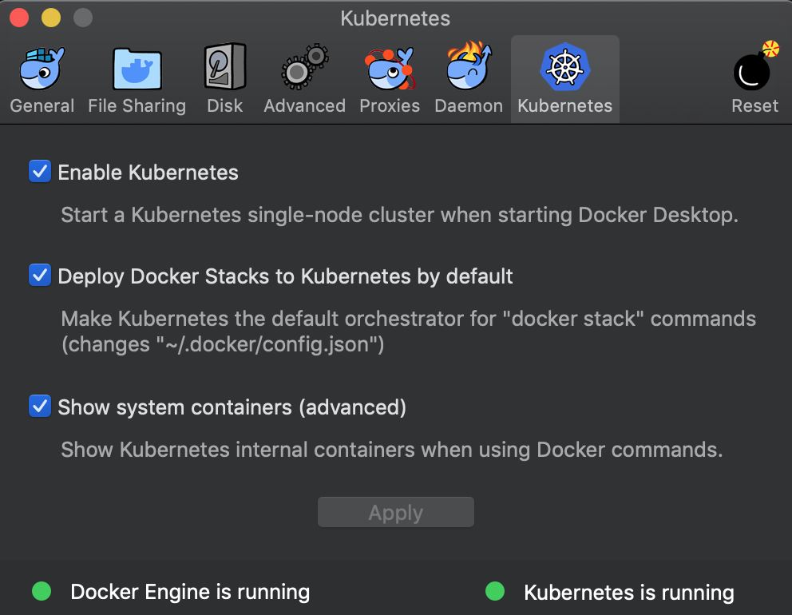

# Setup (Local/Test 환경)

## Preparation

### Docker 및 Kubernetes 환경 구축
1. 환경에 맞게 Docker CE 설치 : https://hub.docker.com/editions/community/docker-ce-desktop-mac
2. Docker CE를 통해서 Kubernetes를 Enable 

3. `$ kubectl version` 실행해서 kubectl 커맨드가 정상적으로 실행되는지 확인한다.

## Install istio
1. istio download
  - 현재 위치에 istio 1.1.2 버전을 다운로드하여 istio-1.1.2 디렉토리에 압축을 풀어준다.
  ```console
  $ curl -L https://git.io/getLatestIstio | ISTIO_VERSION=1.1.2 sh -
  ```

2. istio path 등록
  - istio-1.1.2/bin 디렉토리를 path로 등록한다.
  ```console
  $ export PATH=$PWD/bin:$PATH
  ```
  - bin 디렉토리 아래에는 istioctl 바이너리가 있기때문에, istioctl 커맨드를 바로 사용할 수 있다.

3.1. istio의 helm chart repo를 등록
  - helm repo를 추가하고, 정상적으로 추가되었는지 확인하자.
  ```console
  $ helm repo add istio.io https://storage.googleapis.com/istio-release/releases/1.1.2/charts/
  $ helm repo list | grep istio
  ```

3.2. helm이 설치되지 않았을 경우
  - helm 설치 : https://helm.sh/docs/using_helm/#installing-the-helm-client
  ```console
  # macOS에서는..
  $ brew install kubernetes-helm
  ```

4.1 istio 설치 (using helm template)
  - helm template을 사용하는 설치 방법이며, helm의 tiller가 필요없다.
  - kubenetes에 istio를 설치할 namespace를 생성 (본 예제에서는 istio-system이며 변경 가능)
  ```console
  $ kubectl create namespace istio-system
  ```
  - istio 설치한 디렉토리에서 install/kubernetes/helm/istio-init 밑에 있는 template들을 render하여 kubectl로 실행한다.
    - 이때 위에서 생성한 namesapce를 지정해야함 `--namespace istio-system`
    - 또한 미리 설정해둔 `istio-init`이라는 profile을 사용했다. [여기](https://istio.io/docs/setup/kubernetes/additional-setup/config-profiles/)에서 profile별 어떻게 다른지 알아볼 수 있다.
  ```console
  $ helm template install/kubernetes/helm/istio-init --name istio-init --namespace istio-system | kubectl apply -f -
  # 아래와 같은 kubenetes objects들이 생성된다.
  configmap/istio-crd-10 created
  configmap/istio-crd-11 created
  serviceaccount/istio-init-service-account created
  clusterrole.rbac.authorization.k8s.io/istio-init-istio-system created
  clusterrolebinding.rbac.authorization.k8s.io/istio-init-admin-role-binding-istio-system created
  job.batch/istio-init-crd-10 created
  job.batch/istio-init-crd-11 created
  ```
  - 또한 위의 과정을 통해서 istio의 [Custom Resource Definitions(CRDs)](https://kubernetes.io/docs/concepts/extend-kubernetes/api-extension/custom-resources/#customresourcedefinitions)를 등록한다. 즉, istio에서 사용하는 Custom Resource들에 대해서 Kubernetes cluster에 알리는 단계이다.
  - 등록되는 Custom Resouce들을 53개이며, cert-manager를 활성화했다면 58개로 나올 것이다.
  ```console
  $ kubectl get crds | grep 'istio.io\|certmanager.k8s.io' | wc -l
  53
  ```
 4.2. istio 진짜 설치
  - istio에서 사용하는 Custom Resource를 생성하는 단계이다.
  ```console
  $ helm template install/kubernetes/helm/istio --name istio --namespace istio-system | kubectl apply -f -
  poddisruptionbudget.policy/istio-galley created
  poddisruptionbudget.policy/istio-ingressgateway created
  poddisruptionbudget.policy/istio-policy created
  poddisruptionbudget.policy/istio-telemetry created
  poddisruptionbudget.policy/istio-pilot created
  configmap/istio-galley-configuration created
  configmap/prometheus created
  configmap/istio-security-custom-resources created
  configmap/istio created
  configmap/istio-sidecar-injector created
  serviceaccount/istio-galley-service-account created
  serviceaccount/istio-ingressgateway-service-account created
  serviceaccount/istio-mixer-service-account created
  serviceaccount/istio-pilot-service-account created
  serviceaccount/prometheus created
  # ... 이하 엄청 많이 생성됨
  ```

5.1 Uninstall (using helm template)
  - istio 설치의 역순
  ```console
  $ helm template install/kubernetes/helm/istio --name istio --namespace istio-system | kubectl delete -f -
  $ kubectl delete namespace istio-system
  ```
5.2 Uninstall istio CRDs 
  - 기껏 등록해둔 CRDs를 굳이 지울 필요는 없지만, 그래도 알아보자.
  ```console
  $ kubectl delete -f install/kubernetes/helm/istio-init/files
  ```

6. etc
  - 간혹 예제 스크립트에서 [jq(Json Processor)](https://stedolan.github.io/jq/)를 사용하는 경우도 있으니 설치해두면 개꿀
  ```console
  # macOS에서 설치는
  brew install jq
 
  ```
 
